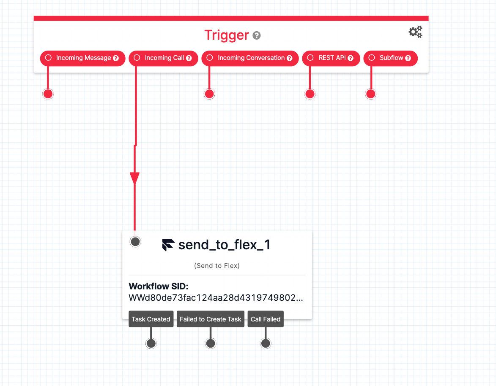

# ConversationRelay Translator

ConversationRelay Translator is an app designed to allow two-way voice commmunication between users who speak different languages, by utilizing realtime translation.

Visit this [link](https://www.twilio.com/en-us/blog/developers/tutorials/product/translation-with-conversationrelay) for a detailed overview of how it works

## Usage Guide

### Setting Up Your Profile

Each profile is tied to a _single_ **Caller** and **Callee** phone number.

Your profile has several configurable options for both the **Caller** (you) and **Callee** (the person you're calling):

#### Caller Settings (Your Phone Number)

- **Language**: Your native language
- **Voice**: The voice used for text-to-speech when translating to you
- **Transcription Provider**: Provider used to transcribe your speech (Deepgram or Google)
- **TTS Provider**: Provider used for text-to-speech to you (Amazon or Google)

#### Callee Settings (Who You Are Calling)

- **Language**: The native language of the person you're calling
- **Voice**: The voice used for text-to-speech when translating to them
- **Transcription Provider**: Provider used to transcribe their speech (Deepgram or Google)
- **TTS Provider**: Provider used for text-to-speech to them (Amazon or Google)
- **Phone Number**: The phone number of the person to call

#### Flex Settings

Using Flex will bypass the **Callee** number and instead send it to Flex using the Studio Flow workflow below.

- **Use Flex**: Enable or disable the use of Flex
- **Flex Number**: The number that is connected to your Studio Flow workflow
- **Flex Worker Handle**: The handle of the worker who will pickup the Flex call

## Deploy Yourself

This will walk you through a short guide on how to deploy the CloudFormation stack needed in this application

### Sam Configuration

Ensure that you have the [AWS SAM CLI](https://docs.aws.amazon.com/serverless-application-model/latest/developerguide/install-sam-cli.html) installed before doing this

Create a `samconfig.toml` file

```toml
version = 0.1

[default.deploy.parameters]
stack_name = "<name>"
region = "<region>"
parameter_overrides = [
    "TwilioAccountSid=<account_sid>",
    "TwilioAuthToken=<auth_token>",
    "AgentPhoneNumber=<number>", # optional default value
    "DefaultPhoneNumber=<number>", # optional default value
    "FlexNumber=<number" # optional default value
]
```

Due to Twilio policy restrictions you must create a bucket beforehand in S3.

Build your SAM template and deploy it

```bash
sam build && sam deploy --capabilities CAPABILITY_NAMED_IAM --s3-bucket <your_bucket_name>
```

This will output some text that you will need to setup the POST method for your phone number. **This is the phone number you will be calling into**.


### Flex (optional)

This application is also able to be used in Flex. By creating a Studio Flow with a handoff to Flex, you can utilize the translation with your Flex agents.

Below is the example JSON for the Studio Flow.

```json
{
  "description": "Conversation Relay Live Translation Flow",
  "states": [
    {
      "name": "Trigger",
      "type": "trigger",
      "transitions": [
        {
          "event": "incomingMessage"
        },
        {
          "next": "send_to_flex_1",
          "event": "incomingCall"
        },
        {
          "event": "incomingConversationMessage"
        },
        {
          "event": "incomingRequest"
        },
        {
          "event": "incomingParent"
        }
      ],
      "properties": {
        "offset": {
          "x": -120,
          "y": 230
        }
      }
    },
    {
      "name": "send_to_flex_1",
      "type": "send-to-flex",
      "transitions": [
        {
          "event": "callComplete"
        },
        {
          "event": "failedToEnqueue"
        },
        {
          "event": "callFailure"
        }
      ],
      "properties": {
        "offset": {
          "x": 20,
          "y": 570
        },
        "workflow": "<your_workflow>",
        "channel": "<channel>",
        "attributes": "{}",
        "priority": "0",
        "timeout": "3600"
      }
    }
  ],
  "initial_state": "Trigger",
  "flags": {
    "allow_concurrent_calls": true
  }
}
```

Your Studio Flow should look like:



Next, connect the `send_to_flex` trigger to your desired Workflow. In order for this to work, you must connect a phone number from inside Studio Flow to this flow.


Finally, set that same phone number as the `Flex Number` in your profile.

### Flex Live Translation Plugin (optional)

There is a plugin that can be combined with this in order to view your live translations in Flex.

Visit this [link](https://github.com/twilio-demos/flex-live-translation-plugin) to learn how to set it up
